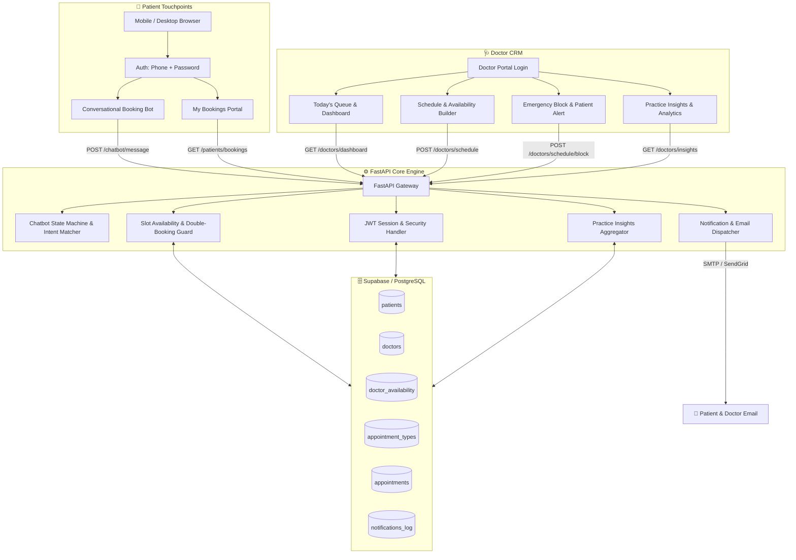

<div align="center">

# 🩺 Cliniq AI Agent
### *The Autonomous Patient Booking & Practice Management CRM for Local & Independent Clinics*

[](LICENSE)
[](https://www.python.org/)
[](https://fastapi.tiangolo.com/)
[](https://react.dev/)
[](https://supabase.com/)
[](https://jwt.io/)

<p align="center">
  <b>Eliminate front-desk bottlenecks, stop patient no-shows, and run your clinic effortlessly 24/7.</b>
  <br />
  A purpose-built, high-reliability booking assistant and doctor CRM designed specifically for solo practitioners and self-running neighborhood clinics.
</p>

---

[The Business Problem](#-the-business-problem) •
[Key Benefits](#-key-benefits-for-clinic-owners) •
[Core Features](#-core-features) •
[System Architecture](#-system-architecture) •
[Tech Stack](#-tech-stack) •
[Quick Start](#-quick-start-guide) •
[API Reference](#-api-endpoints) •
[Implementation Roadmap](#-implementation-roadmap)

---

</div>

## 💡 The Business Problem

Independent medical practitioners and local clinic owners face a relentless front-desk dilemma:

* **Receptionist Overhead:** Hiring full-time front-desk staff eats up significant clinic revenue, yet calls still go unanswered during lunch breaks, after-hours, and peak patient consultation windows.
* **Scheduling Chaos & Double Bookings:** Manual paper registers and informal WhatsApp messages lead to overlapping appointments, patient frustration, and unpredictable waiting room delays.
* **Missed Revenue from No-Shows:** Without automated booking confirmations and timely reminders, clinics lose up to 20–30% of scheduled consultation slots.
* **Emergency Schedule Disruptions:** When a doctor is called into surgery or falls ill, notifying 15–20 booked patients manually via telephone takes hours.

### The Solution: Cliniq AI Agent
**Cliniq AI Agent** bridges the gap with a zero-friction, automated patient booking assistant paired with a focused **Doctor CRM Dashboard**. It delivers enterprise-grade clinic efficiency with zero bloated software complexity.

---

## 🌟 Key Benefits for Clinic Owners

| For The Clinic / Doctor | For The Patient |
| :--- | :--- |
| 🕒 **24/7 Zero-Staff Booking:** Accept confirmed appointments around the clock without answering calls. | ⚡ **30-Second Booking:** Instant, guided conversational booking with zero app downloads required. |
| 🚫 **Guaranteed Zero Double-Bookings:** Real-time database slot locking prevents duplicate bookings. | 📅 **Live Slot Transparency:** Choose exactly the date and time that fits their personal schedule. |
| 🚨 **Instant Emergency Broadcast:** Block a day with 1 click; affected patients receive immediate automated alerts. | 🔄 **Self-Service Rescheduling:** Reschedule or cancel with quick-reply buttons—no friction, no awkward calls. |
| 📊 **Actionable Practice Analytics:** Track patient counts, busiest days, and retention trends at a glance. | 📧 **Automated Email Confirmations:** Immediate booking proofs and reminders straight to their inbox. |

---

## 🎯 Target Audience & Use Cases

* **Solo Medical Practices:** General Physicians, Pediatricians, Gynecologists, and Dermatologists managing their own practice.
* **Dental & Orthodontic Clinics:** Managing structured consultation time slots and procedure follow-ups.
* **Physiotherapy & Wellness Centers:** Streamlining recurring sessions and patient intake.
* **Neighborhood Polyclinics:** Seeking an affordable, reliable digital upgrade from physical paper registers.

---

## 🚀 Core Features

### 1. 🤖 Patient Booking Assistant (Decision-Tree Engine)
Unlike unpredictable LLMs that hallucinate medical advice or confuse appointment times, Cliniq AI Agent utilizes a deterministic, **finite-state conversational engine**:
* **Natural Intent Recognition:** Understands patient phrases like *"I need an appointment"*, *"cancel my checkup"*, or *"reschedule for next week"*.
* **Interactive Quick-Reply Chips:** Renders responsive UI buttons for appointment types, calendar pickers, and live available slots.
* **Self-Service Patient Portal:** Dedicated "My Bookings" page displaying active booking IDs, doctor details, dates, and live status.
* **Smart Enquiry Routing:** Unrecognized questions or specific medical queries are safely channeled to the doctor's CRM enquiry inbox.

### 2. 👨‍⚕️ Doctor CRM & Practice Management Dashboard
A streamlined control center tailored for practicing doctors:
* **Today's Queue:** Instant visibility into today's confirmed schedule, patient names, and visit reasons.
* **Upcoming Roster:** 7-day calendar breakdown of appointments.
* **Schedule & Availability Manager:** Configure working hours, consultation slot durations (e.g., 15m, 30m, 45m), and off-days.
* **Emergency Slot Blocker:** Block specific hours or full days in an emergency—automatically triggering notification alerts to booked patients.
* **Patient Enquiry Inbox:** Review and respond to general questions submitted through the chatbot.
* **Clinic Growth Insights:** Rule-based reporting summarizing total patients seen, cancellation ratios, busiest operational days, and new vs. returning patient volume.

### 3. 📬 Notification & Communication Engine
* **Instant Confirmation:** Sends detailed appointment emails with unique Booking Reference IDs (`APT-YYYYMMDD-XXX`).
* **Reschedule & Cancellation Notices:** Immediate updates when bookings are changed.
* **Scheduled Reminders:** Automated reminder emails sent prior to appointments to slash no-show rates.
* **Emergency Reschedule Invites:** Direct rebooking links sent when doctor availability changes unexpectedly.

---

## 🏗 System Architecture



---

## 💻 Tech Stack

| Layer | Technology | Purpose |
| :--- | :--- | :--- |
| **Backend Framework** | [FastAPI](https://fastapi.tiangolo.com/) (Python 3.11+) | High-performance, asynchronous REST API with automatic OpenAPI documentation |
| **Database** | [Supabase](https://supabase.com/) / [PostgreSQL](https://www.postgresql.org/) | Reliable relational database with ACID compliance for appointment transactions |
| **ORM & Migrations** | [SQLAlchemy](https://www.sqlalchemy.org/) + Alembic | Strongly typed data models and expressive SQL querying |
| **Frontend** | [React 18](https://react.dev/) + [Vite](https://vitejs.dev/) | Lightning-fast, modern reactive client interfaces |
| **Authentication** | Custom Phone + Password | Secure password hashing (`bcrypt`) and stateless JWT bearer token authentication |
| **Conversational Engine** | Rule-Based State Machine + Intent Matcher | Deterministic, zero-hallucination patient scheduling engine |
| **Notifications** | SMTP / SendGrid Free Tier | Automated transactional and reminder emails |

---

## 🗃 Database Schema

```
patients
  ├── id (PK, UUID)
  ├── full_name (VARCHAR)
  ├── phone_number (VARCHAR, Unique, Login key)
  ├── password_hash (VARCHAR)
  ├── email (VARCHAR)
  └── created_at (TIMESTAMP)

doctors
  ├── id (PK, UUID)
  ├── full_name (VARCHAR)
  ├── phone_number (VARCHAR, Unique, Login key)
  ├── password_hash (VARCHAR)
  ├── email (VARCHAR)
  ├── specialization (VARCHAR)
  └── created_at (TIMESTAMP)

doctor_availability
  ├── id (PK, SERIAL)
  ├── doctor_id (FK -> doctors.id)
  ├── date (DATE)
  ├── start_time (TIME)
  ├── end_time (TIME)
  ├── slot_duration_minutes (INT)
  └── is_blocked (BOOLEAN, default: false)

appointment_types
  ├── id (PK, SERIAL)
  ├── name (VARCHAR, e.g. "General Consultation", "Follow-up")
  └── duration_minutes (INT)

appointments
  ├── id (PK, SERIAL)
  ├── booking_id (VARCHAR, Unique, e.g. APT-20260915-001)
  ├── patient_id (FK -> patients.id)
  ├── doctor_id (FK -> doctors.id)
  ├── appointment_type_id (FK -> appointment_types.id)
  ├── date (DATE)
  ├── time_slot (TIME)
  ├── status (ENUM: booked, cancelled, rescheduled, completed)
  ├── notes (TEXT)
  ├── created_at (TIMESTAMP)
  └── updated_at (TIMESTAMP)

notifications_log
  ├── id (PK, SERIAL)
  ├── appointment_id (FK -> appointments.id)
  ├── channel (VARCHAR, email)
  ├── type (VARCHAR: booking_confirmation, cancellation, reschedule, reminder, emergency_notice)
  ├── sent_at (TIMESTAMP)
  └── status (VARCHAR: sent, failed)
```

---

## ⚡ Quick Start Guide

### Prerequisites
* **Python:** 3.11 or higher
* **Node.js:** 18.x or higher
* **PostgreSQL / Supabase Account:** Free tier database instance

### 1. Clone & Setup Repository
```bash
git clone https://github.com/Josephvarghes/cliniq-ai-agent.git
cd cliniq-ai-agent
```

### 2. Backend Setup (FastAPI)
```bash
# Navigate to backend directory
cd backend

# Create virtual environment
python -m venv venv

# Activate virtual environment
# On Windows:
.\venv\Scripts\activate
# On macOS/Linux:
source venv/bin/activate

# Install backend dependencies
pip install -r requirements.txt

# Configure environment variables
cp .env.example .env
```

Edit your `.env` file with your credentials:
```env
DATABASE_URL=postgresql://postgres:[PASSWORD]@[HOST]:5432/postgres
JWT_SECRET_KEY=your_secure_jwt_secret_key_here
JWT_ALGORITHM=HS256
ACCESS_TOKEN_EXPIRE_MINUTES=1440
SMTP_HOST=smtp.gmail.com
SMTP_PORT=587
SMTP_USER=yourclinic@gmail.com
SMTP_PASSWORD=your_app_password
DOCTOR_DEFAULT_PHONE=9876543210
```

Run the backend server:
```bash
uvicorn app.main:app --reload --port 8000
```
Interactive Swagger API documentation will be available at: `http://localhost:8000/docs`

### 3. Frontend Setup (React)
```bash
# Navigate to frontend directory
cd ../frontend

# Install dependencies
npm install

# Start development server
npm run dev
```
Open `http://localhost:5173` in your browser.

---

## 📡 API Endpoints

### 🔐 Authentication
* `POST /auth/patient/signup` — Register a new patient account (Phone + Password)
* `POST /auth/patient/login` — Patient login returning JWT access token
* `POST /auth/doctor/login` — Doctor CRM login returning JWT access token

### 💬 Chatbot & Booking
* `POST /chatbot/message` — Process conversational turn (intent recognition, state transitions, slot presentation)
* `GET  /chatbot/availability?date=YYYY-MM-DD` — Retrieve available open slots for the clinic doctor

### 📅 Appointments
* `GET  /patients/{id}/bookings` — Retrieve all past and upcoming bookings for a patient
* `POST /appointments/book` — Reserve a specific slot and issue a `booking_id`
* `POST /appointments/{id}/cancel` — Cancel an appointment and free the slot
* `POST /appointments/{id}/reschedule` — Reassign an appointment to a new date/time

### 🩺 Doctor CRM Operations
* `GET  /doctors/{id}/dashboard` — Fetch today's queue, 7-day bookings, and patient enquiries
* `GET  /doctors/{id}/schedule` — View configured availability intervals
* `POST /doctors/{id}/schedule` — Define new operational hours and slot intervals
* `POST /doctors/{id}/schedule/block` — Emergency block a slot/day and broadcast alert emails
* `GET  /doctors/{id}/insights?range=monthly` — Aggregated clinic performance and volume analytics

---

## 🗺 Implementation Roadmap

- [x] **System Specification & Architecture Design**
- [ ] **Phase 1: Foundation** — Supabase DB schema, SQLAlchemy ORM models, and JWT authentication
- [ ] **Phase 2: Doctor Schedule Engine** — Doctor availability creation, viewing, and slot generation
- [ ] **Phase 3: Conversational Bot Engine** — Finite-state machine, intent detection, and end-to-end booking flow
- [ ] **Phase 4: Modification Workflows** — Self-service cancellation and rescheduling logic
- [ ] **Phase 5: Notification Service** — Transactional email dispatch for confirmations and cancellations
- [ ] **Phase 6: Frontend Portals** — Patient chatbot UI, "My Bookings" page, and Doctor CRM dashboard
- [ ] **Phase 7: Clinic Analytics** — Aggregated SQL metrics and templated performance insights
- [ ] **Phase 8: Emergency Handling** — Slot blocking with automated patient broadcast alerts
- [ ] **Phase 9: Reliability & Polish** — Appointment reminder cron jobs, race-condition double-booking locks, and validation

---

## 🛡 Security & Design Principles

1. **Deterministic Scheduling:** No generative AI unpredictability in the booking path; appointments are locked strictly via validated database transactions.
2. **Password Security:** All credentials are cryptographically hashed using `bcrypt` / `argon2`.
3. **Data Integrity:** Database-level uniqueness constraints prevent concurrent overbooking of doctor slots.
4. **HIPAA & Privacy Conscious:** Minimal required data collection (Name, Phone, Email, Visit Reason); sensitive patient details are never transmitted over unencrypted channels.

---

## 📄 License & Attribution

Designed and maintained by [Joseph Varghese](https://github.com/Josephvarghes).  
Licensed under the [MIT License](LICENSE).